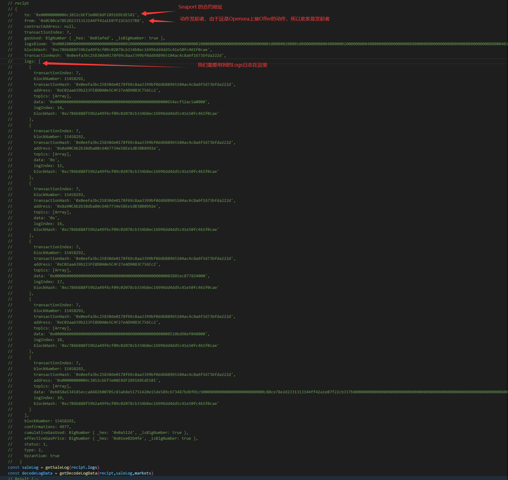

# 0x00 前期准备

用一个Tx作为我们的参考

就用这个交易来进行举例吧:

0x0eefa3bc25830de0178f69c8aa3399bf0dd688965104ac4c8a6f1673bfda222d

NFT合约地址（Doodles） ：0x8a90CAb2b38dba80c64b7734e58Ee1dB38B8992e 

卖家 : 0x0C80ce78E2D2331313144ff42a1E07F22Cb337B8 

买家: 0xB8407C337C8E32dA7D6095EB527dec3c2D7FA0dA 

tokenID : 1741 

WETH的合约地址 : 0xC02aaA39b223FE8D0A0e5C4F27eAD9083C756Cc2 

框架安装

ethers web3-eth-abi

0x01 代码解析

步骤解析

拿到该交易(Tx)的收据(Recipt)

根据Recipt中的Log找到我们的Transfer事件和Sale事件

解析Transfer事件以获得买家和卖家

解析Sale事件以获得价格

如何获得该tx的收据

我们通过Provider提供的服务来获得我们Tx中的Recipt

```js
const ethers = require("ethers")
async function getRecipt{
  const provider = ethes.getDefaultProvider("homestead",{
    alchemy:ALCHEMY // 我用的alchemy，这里填你们的API_KEY
  })
  const recipt = await provider.getTransactionReceipt(tx)
  console.log(recipt)
}
```

我们获得的Recipt是个这样的东西：

根据Logs获得我们的Transfer事件跟Sale事件

首先我们需要分析一下Logs里面都有啥？


那我们开始解析Transfer事件吧

我们的logEvents文件是这样的

logEventType.js:

```js
const transferEventTypes = {
    ERC721: '0xddf252ad1be2c89b69c2b068fc378daa952ba7f163c4a11628f55a4df523b3ef', // Transfer
    ERC1155: [
        '0xc3d58168c5ae7397731d063d5bbf3d657854427343f4c083240f7aacaa2d0f62', // TransferSingle
        '0x4a39dc06d4c0dbc64b70af90fd698a233a518aa5d07e595d983b8c0526c8f7fb' // TransferBatch
    ]
};

const saleEventTypes = [
    '0xc4109843e0b7d514e4c093114b863f8e7d8d9a458c372cd51bfe526b588006c9', // OrdersMatched
    '0xe2c49856b032c255ae7e325d18109bc4e22a2804e2e49a017ec0f59f19cd447b', // EvProfit (X2Y2)
    '0x95fb6205e23ff6bda16a2d1dba56b9ad7c783f67c96fa149785052f47696f2be', // TakerBid (LooksRare)
    '0x68cd251d4d267c6e2034ff0088b990352b97b2002c0476587d0c4da889c11330', // TakerAsk (LooksRare)
    '0x9d9af8e38d66c62e2c12f0225249fd9d721c54b83f48d9352c97c6cacdcb6f31', // OrderFulfilled (Seaport)
    '0x8873f53f40d4865bac9c1e8998aef3351bb1ef3db1a6923ab09621cf1a6659a9' // swapEvent (NFT Trader)
];
module.exports =  { transferEventTypes, saleEventTypes };
```


```js

function getTransferLog(logs){
    for(const log of logs){
        // CONTRACT_ADDR : 0x8a90CAb2b38dba80c64b7734e58Ee1dB38B8992e 
       if(transferEvents.includes(log.topics[0])&&log.address===CONTRACT_ADDR){
            console.log(log.topics)
            const from = log.topics[1]
            const to = log.topics[2]
            const tokenId = log.topics[3]
            return [ethers.utils.hexValue(from),ethers.utils.hexValue(to),parseInt(Number(tokenId))]
        }
    }
}
```

解析Sale事件 拿到price
解码Data里面的数据
我们需要解码的ABI
根据相应的合约地址我们找到相应的ABI进行解码
```js
module.exports.markets = {
    // NFT Trader BatchSwap Address
    '0x657e383edb9a7407e468acbcc9fe4c9730c7c275': {
        name: 'NFT Trader 🔄',
        color: '#dbff00',
        site: 'https://etherscan.io/tx/',
        accountPage: 'https://opensea.io/',
        iconURL: 'https://pbs.twimg.com/profile_images/1538537469779623937/pHkL_wiw_400x400.png',
        logDecoder: [
            {
                type: 'uint256',
                name: '_swapId'
            },
            {
                type: 'address',
                name: '_counterPart'
            },
            {
                type: 'address',
                name: '_referral'
            }
        ]
    },
    // GemSwap Contract Address
    '0x83c8f28c26bf6aaca652df1dbbe0e1b56f8baba2': {
        name: 'Gem 💎',
        color: '#f07a9d',
        site: 'https://www.gem.xyz/asset/',
        accountPage: 'https://www.gem.xyz/profile/',
        iconURL: 'https://pbs.twimg.com/profile_images/1469735318488293380/AuOdfwvH_400x400.jpg'
    },
    // Gem Single Contract Checkout 1 Address
    '0x0000000031f7382a812c64b604da4fc520afef4b': {
        name: 'Gem 💎',
        color: '#f07a9d',
        site: 'https://www.gem.xyz/asset/',
        accountPage: 'https://www.gem.xyz/profile/',
        iconURL: 'https://pbs.twimg.com/profile_images/1469735318488293380/AuOdfwvH_400x400.jpg'
    },
    // Gem Single Contract Checkout 2 Address
    '0x0000000035634b55f3d99b071b5a354f48e10bef': {
        name: 'Gem 💎',
        color: '#f07a9d',
        site: 'https://www.gem.xyz/asset/',
        accountPage: 'https://www.gem.xyz/profile/',
        iconURL: 'https://pbs.twimg.com/profile_images/1469735318488293380/AuOdfwvH_400x400.jpg'
    },
    // Gem Single Contract Checkout 3 Address
    '0x00000000a50bb64b4bbeceb18715748dface08af': {
        name: 'Gem 💎',
        color: '#f07a9d',
        site: 'https://www.gem.xyz/asset/',
        accountPage: 'https://www.gem.xyz/profile/',
        iconURL: 'https://pbs.twimg.com/profile_images/1469735318488293380/AuOdfwvH_400x400.jpg'
    },
    // Gem Single Contract Checkout 4 Address
    '0xae9c73fd0fd237c1c6f66fe009d24ce969e98704': {
        name: 'Gem 💎',
        color: '#f07a9d',
        site: 'https://www.gem.xyz/asset/',
        accountPage: 'https://www.gem.xyz/profile/',
        iconURL: 'https://pbs.twimg.com/profile_images/1469735318488293380/AuOdfwvH_400x400.jpg'
    },
    // GenieSwap Contract Address
    '0x0a267cf51ef038fc00e71801f5a524aec06e4f07': {
        name: 'Genie 🧞‍♂️',
        color: '#ffffff',
        site: 'https://opensea.io/assets/',
        accountPage: 'https://opensea.io/',
        iconURL: 'https://pbs.twimg.com/profile_images/1486044157017788419/cqdhpZBX_400x400.png'
    },
    // X2Y2 Contract Address
    '0x74312363e45dcaba76c59ec49a7aa8a65a67eed3': {
        name: 'X2Y2 ⭕️',
        color: '#00e0ff',
        site: 'https://x2y2.io/eth/',
        accountPage: 'https://x2y2.io/user/',
        iconURL: 'https://pbs.twimg.com/profile_images/1482386069891198978/mMFwXNj8_400x400.jpg',
        logDecoder: [
            {
                type: 'bytes32',
                name: 'itemHash'
            },
            {
                type: 'address',
                name: 'currency'
            },
            {
                type: 'address',
                name: 'to'
            },
            {
                type: 'uint256',
                name: 'amount'
            }
        ]
    },
    // OpenSea Contract Address
    '0x7f268357a8c2552623316e2562d90e642bb538e5': {
        name: 'OpenSea: Wyvern 🌊',
        color: '#2484e4',
        site: 'https://opensea.io/assets/',
        accountPage: 'https://opensea.io/',
        iconURL: 'https://pbs.twimg.com/profile_images/1533843334946508806/kleAruEh_400x400.png',
        logDecoder: [
            {
                type: 'bytes32',
                name: 'buyHash'
            },
            {
                type: 'bytes32',
                name: 'sellHash'
            },
            {
                type: 'uint256',
                name: 'price'
            }
        ]
    },
    // LooksRareExchange Contract Address
    '0x59728544b08ab483533076417fbbb2fd0b17ce3a': {
        name: 'LooksRare 👀💎',
        color: '#0ce465',
        site: 'https://looksrare.org/collections/',
        accountPage: 'https://looksrare.org/accounts/',
        iconURL: 'https://pbs.twimg.com/profile_images/1493172984240308225/Nt6RFdmb_400x400.jpg',
        logDecoder: [
            {
                type: 'bytes32',
                name: 'orderHash'
            },
            {
                type: 'uint256',
                name: 'orderNonce'
            },
            {
                type: 'address',
                name: 'currency'
            },
            {
                type: 'address',
                name: 'collection'
            },
            {
                type: 'uint256',
                name: 'tokenId'
            },
            {
                type: 'uint256',
                name: 'amount'
            },
            {
                type: 'uint256',
                name: 'price'
            }
        ]
    },
    '0x00000000006c3852cbef3e08e8df289169ede581': {
        name: 'Opensea: Seaport ⚓️',
        color: '#399dff',
        site: 'https://opensea.io/assets/',
        accountPage: 'https://opensea.io/',
        iconURL: 'https://pbs.twimg.com/profile_images/1537131404550582272/TvRw2kcG_400x400.jpg',
        logDecoder: [
            {
                type: 'bytes32',
                name: 'orderHash'
            },
            {
                type: 'address',
                name: 'recipient'
            },
            {
                type: 'tuple[]',
                name: 'offer',
                components: [
                    {
                        type: 'uint8',
                        name: 'itemType'
                    },
                    {
                        type: 'address',
                        name: 'token'
                    },
                    {
                        type: 'uint256',
                        name: 'identifier'
                    },
                    {
                        type: 'uint256',
                        name: 'amount'
                    }
                ]
            },
            {
                type: 'tuple[]',
                name: 'consideration',
                components: [
                    {
                        type: 'uint8',
                        name: 'itemType'
                    },
                    {
                        type: 'address',
                        name: 'token'
                    },
                    {
                        type: 'uint256',
                        name: 'identifier'
                    },
                    {
                        type: 'uint256',
                        name: 'amount'
                    },
                    {
                        type: 'address',
                        name: 'recipient'
                    }
                ]
            }
        ]
    },
    '0x0804b76278eac7c719ee7b7921b3f1071d1ae2f7': {
        name: 'Opensea: Seaport ⚓️',
        color: '#399dff',
        site: 'https://opensea.io/assets/',
        accountPage: 'https://opensea.io/',
        iconURL: 'https://pbs.twimg.com/profile_images/1537131404550582272/TvRw2kcG_400x400.jpg',
        logDecoder: [
            {
                type: 'bytes32',
                name: 'orderHash'
            },
            {
                type: 'address',
                name: 'recipient'
            },
            {
                type: 'tuple[]',
                name: 'offer',
                components: [
                    {
                        type: 'uint8',
                        name: 'itemType'
                    },
                    {
                        type: 'address',
                        name: 'token'
                    },
                    {
                        type: 'uint256',
                        name: 'identifier'
                    },
                    {
                        type: 'uint256',
                        name: 'amount'
                    }
                ]
            },
            {
                type: 'tuple[]',
                name: 'consideration',
                components: [
                    {
                        type: 'uint8',
                        name: 'itemType'
                    },
                    {
                        type: 'address',
                        name: 'token'
                    },
                    {
                        type: 'uint256',
                        name: 'identifier'
                    },
                    {
                        type: 'uint256',
                        name: 'amount'
                    },
                    {
                        type: 'address',
                        name: 'recipient'
                    }
                ]
            }
        ]
    }
};

```

```js
// 将data 解码 获得result
function getDecodeLogData(recipt,saleLog,markets){
        const toAddr = recipt["to"].toLowerCase()
        const marketLogDecoder = markets[toAddr].logDecoder
        const decodeLogData = Web3EthAbi.decodeLog(marketLogDecoder,saleLog.data,[])
        return decodeLogData
}
// 根据解码的内容来解析sale里面的数据
const parseSaleLog = (decodedLogData)=>{
    const offer = decodedLogData.offer
    const consideration = decodedLogData.consideration
    const nftOnOfferSide = offer.some((item)=>item.token.toLowerCase() === CONTRACT_ADDR.toLowerCase())
    const nftOnConsiderationSide = consideration.some((item)=>item.token.toLowerCase() === CONTRACT_ADDR.toLocaleLowerCase())
    // 两种情况
    // 如果nft在offerSide
    // 如果nft在considerationSide
    if(nftOnOfferSide){
        const totalConsiderationAmount = consideration.reduce((pre,cur)=>{
            const currency = currencies[cur.token.toLocaleLowerCase()]
            if(currency!==undefined){
                console.log(currency)
                const result = pre + Number(ethers.utils.formatUnits(cur.amount,currency.decimals))
                return result
            }else{
                return pre
            }
        },0)
        price = totalConsiderationAmount
    }else{
        const totalOfferAmount = offer.reduce((pre,cur)=>{
            const currency = currencies[cur.token.toLocaleLowerCase()]
            if(currency!==undefined){
                console.log(currency)
                const result = pre + Number(ethers.utils.formatUnits(cur.amount,currency.decimals))
                return result
            }else{
                return pre
            }
        },0)
        price = totalOfferAmount
    }
    return price

}
```


完整版的代码
```js
const ALCHEMY = require("./config/settings").ALCHEMY
const ethers = require("ethers")
const currencies = require('./config/currencies').currencies
const Web3EthAbi = require("web3-eth-abi")
const logEvents = require("./config/logEventType")
const markets = require("./config/markets").markets
const network = "homestead"
const CONTRACT_ADDR = require("./config/settings").CONTRACT_ADDR
const saleEvents = logEvents.saleEventTypes
const transferEvents = [logEvents.transferEventTypes['ERC721'],...logEvents.transferEventTypes['ERC1155']]
async function decodeSeaport(tx){
    const provider = ethers.getDefaultProvider(network,{
        alchemy:ALCHEMY
    })
    const recipt = await provider.getTransactionReceipt(tx)
    const saleLog = getSaleLog(recipt.logs)
    const decodeLogData = getDecodeLogData(recipt,saleLog,markets)
    const price = parseSeaport(decodeLogData)
    const [nftFrom,nftTo,nftTokenId] = getTransferLog(recipt.logs)
    console.log(price,nftFrom,nftTo,nftTokenId)
    
}
function getSaleLog(logs){
    for(const log of logs){
        if(saleEvents.includes(log.topics[0])){
            return log
        }
    }
}
// Decode Log Data
function getTransferLog(logs){
    for(const log of logs){
        if(transferEvents.includes(log.topics[0])&&log.address===CONTRACT_ADDR){
            console.log(log.topics)
            const from = log.topics[1]
            const to = log.topics[2]
            const tokenId = log.topics[3]
            return [ethers.utils.hexValue(from),ethers.utils.hexValue(to),parseInt(Number(tokenId))]
        }
    }
}

function getDecodeLogData(recipt,saleLog,markets){
        const toAddr = recipt["to"].toLowerCase()
        const marketLogDecoder = markets[toAddr].logDecoder
        const decodeLogData = Web3EthAbi.decodeLog(marketLogDecoder,saleLog.data,[])
        return decodeLogData
}
//
const parseSeaport = (decodedLogData)=>{
    const offer = decodedLogData.offer
    const consideration = decodedLogData.consideration
    const nftOnOfferSide = offer.some((item)=>item.token.toLowerCase() === CONTRACT_ADDR.toLowerCase())
    const nftOnConsiderationSide = consideration.some((item)=>item.token.toLowerCase() === CONTRACT_ADDR.toLocaleLowerCase())
    // 两种情况
    // 如果nft在offerSide
    // 如果nft在considerationSide
    if(nftOnOfferSide){
        const totalConsiderationAmount = consideration.reduce((pre,cur)=>{
            const currency = currencies[cur.token.toLocaleLowerCase()]
            if(currency!==undefined){
                console.log(currency)
                const result = pre + Number(ethers.utils.formatUnits(cur.amount,currency.decimals))
                return result
            }else{
                return pre
            }
        },0)
        price = totalConsiderationAmount
    }else{
        const totalOfferAmount = offer.reduce((pre,cur)=>{
            const currency = currencies[cur.token.toLocaleLowerCase()]
            if(currency!==undefined){
                console.log(currency)
                const result = pre + Number(ethers.utils.formatUnits(cur.amount,currency.decimals))
                return result
            }else{
                return pre
            }
        },0)
        price = totalOfferAmount
    }
    return price

}
decodeSeaport('0x0eefa3bc25830de0178f69c8aa3399bf0dd688965104ac4c8a6f1673bfda222d')
```

## 总结

其实一开始的内容比较重要，掌握了原理之后就可以根据数据来进行解析了。后面的代码是实现，怎么实现是不重要的，最重要的是要知道里面的数据结构，以及怎么样去找到我们想要的数据